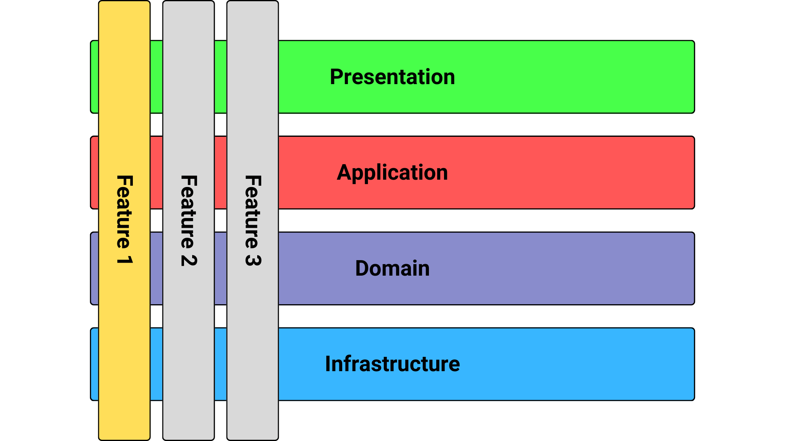

# Task Manager Web API

The Task Manager Web API is an ASP.NET Core API built with C#/.NET to create, read, update and delete tasks for a front-end consumer following [the RESTful API pattern](https://learn.microsoft.com/pt-br/azure/architecture/best-practices/api-design), [Vertical Slice Architecture](https://www.milanjovanovic.tech/blog/vertical-slice-architecture) and [CQRS pattern](https://learn.microsoft.com/en-us/azure/architecture/patterns/cqrs).

## What is Vertical Slice Architecture and Why Use It?

The objective of Vertical Slice Architecture is to **minimize coupling between unrelated features and maximize coupling in a single feature**, differing from Clean Architecture, which maximizes coupling in a single layer, it was first introduced by **Jimmy Bogard** in 2018 in his [personal blog](https://www.jimmybogard.com/vertical-slice-architecture/).

It is easy for other developers to understand and maintain. There is also no need to create multiple layers since the coupling is contained within a single feature (slice). Here's an image example:

And it is also a small project, so I would be adding unnecessary complexity by using [Clean Architecture](https://learn.microsoft.com/en-us/dotnet/architecture/modern-web-apps-azure/common-web-application-architectures#clean-architecture).

## Technical Requirements

* [.NET 8.0](https://dotnet.microsoft.com/pt-br/download/dotnet/8.0)
* [Visual Studio 2022](https://visualstudio.microsoft.com/vs/community/) or [Visual Studio Code](https://code.visualstudio.com/)

## How to Run:

After cloning the repository and installing all the software listed in the technical requirements, follow the instructions below:

### Visual Studio 2022

1. Open **Visual Studio 2022**
2. In the menu go to **File** then **Open**
3. Select **Open solution** 
4. In the top corner press **https** launch settings to run and debug the **TaskManager.WebApi**

### VSCode

1. Open **VSCode**
2. Press the `F5` key to run and debug the project or open the **Terminal** and run:

`cd src/TaskManager.WebApi/ && dotnet run`

3. In your browser go to [localhost:7221](https://localhost:7221) and test the API with Swagger

## Endpoints

### Get all tasks

**GET** `/api/tasks`

Returns a list of all tasks.

---

### Get task by id

**GET** `/api/tasks/{id}`

Returns a task with the specified ID.

---

### Get tasks by expiration date

**GET** `/api/tasks/expires-date/{expiresAt}`

Returns tasks that match the specified expiration date.

---

### Get tasks by status

**GET** `/api/tasks/status/{status}`

Returns tasks with the specified status.

Possible values:

- **0** – Pending  
- **1** – In Progress  
- **2** – Finished

---

### Create a task

**POST** `/api/tasks`

Creates a new task.

---

### Update a task

**PUT** `/api/tasks/{id}`

Updates the task with the specified ID.

---

### Start a task

**PUT** `/api/tasks/{id}/start`

Changes the task status to **In Progress**.

---

### Finish a task

**PUT** `/api/tasks/{id}/finish`

Changes the task status to **Finished**.